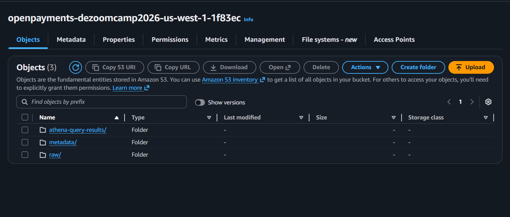
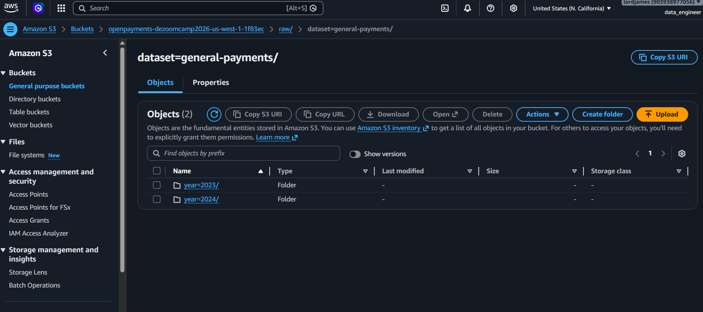
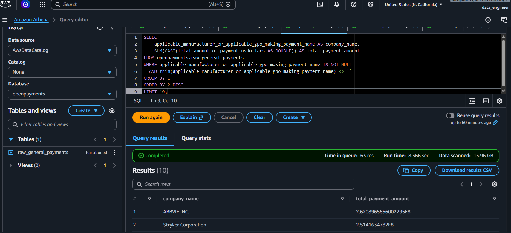
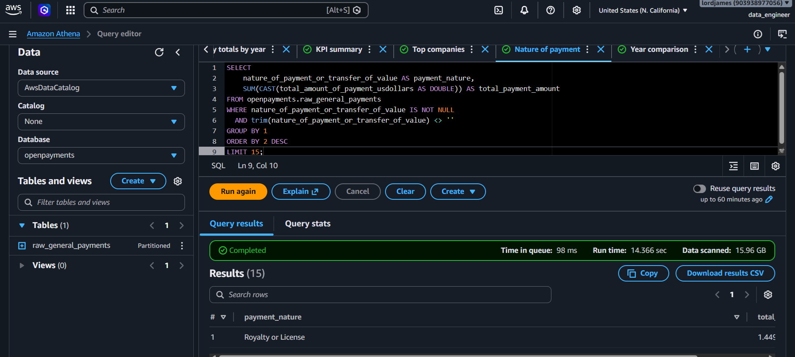
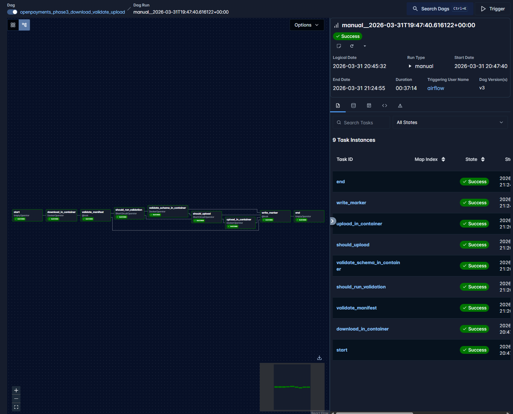
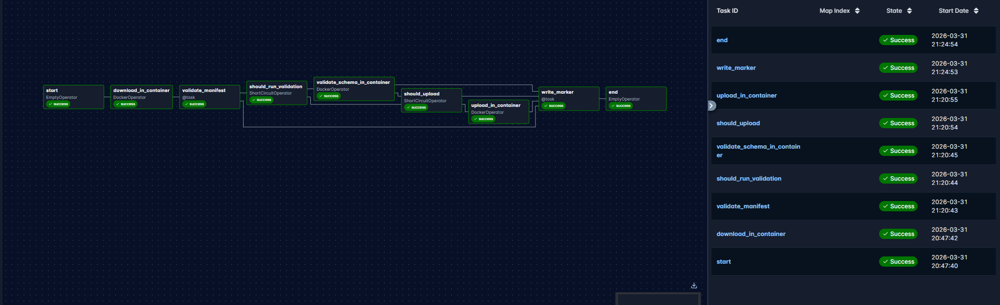
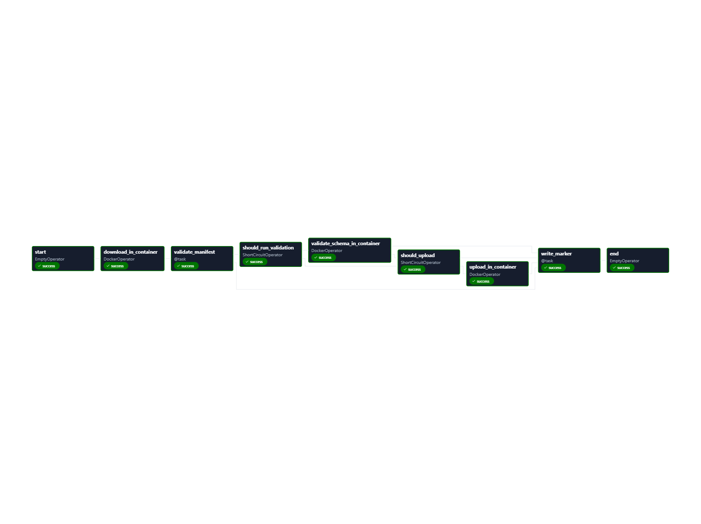
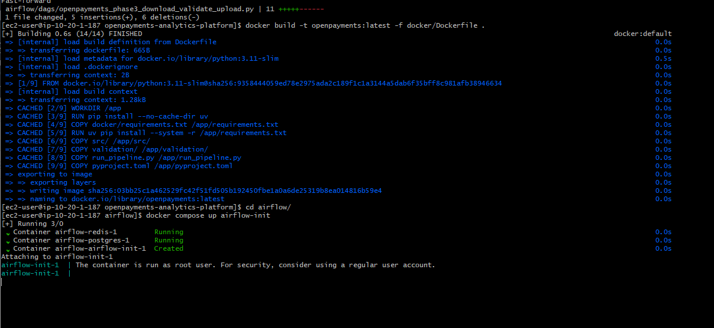
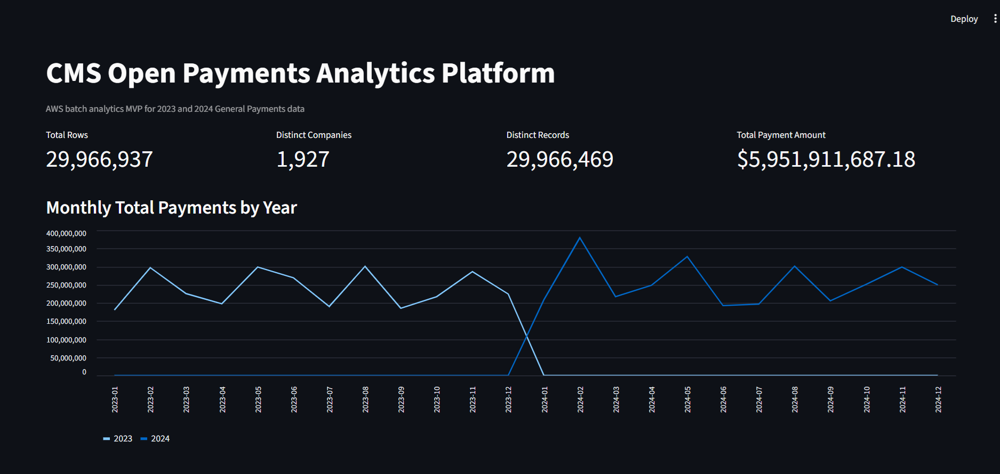
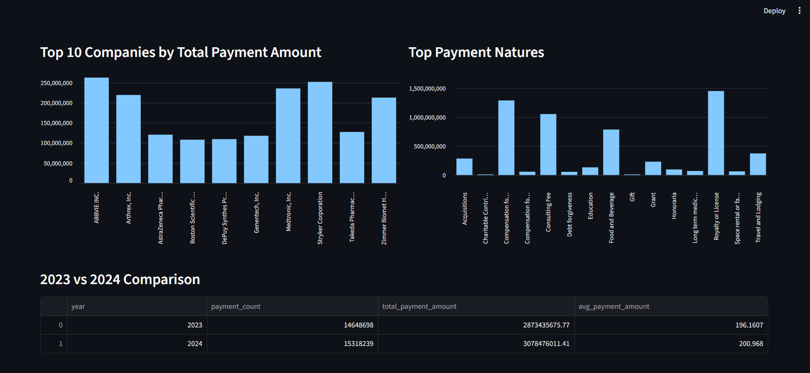

# CMS Open Payments Analytics Platform on AWS

An end-to-end batch analytics project built on AWS around the **CMS Open Payments – General Payments** dataset for **2023 and 2024**.

This project ingests raw public payment data, validates it, uploads it to Amazon S3, exposes it through Athena using the AWS Glue Data Catalog, and serves analytical outputs in a live Streamlit dashboard. Workflow orchestration is handled with Apache Airflow running on EC2, and infrastructure setup is partially supported with Terraform for reproducibility and documentation.

---

## Problem Description

The CMS Open Payments dataset contains public records of transfers of value and other payments made by applicable manufacturers and group purchasing organizations to healthcare providers and teaching hospitals in the United States.

The raw source is useful, but not convenient for fast analysis in its original form because:

- it needs structured ingestion and validation
- it is large enough that manual analysis becomes messy and repetitive
- it needs cloud storage and a query layer for reuse
- analysts need fast answers to questions like:
  - how total payments change over time
  - which companies make the largest payments
  - which payment categories dominate
  - how 2023 compares with 2024

This project solves that by building a practical AWS batch analytics pipeline that takes the data from extraction to cloud storage, query access, orchestration evidence, and dashboard output.

---

## Project Scope

### Dataset
- **Source**: CMS Open Payments
- **Domain**: General Payments
- **Years covered**: **2023** and **2024**

### Main questions answered
- How do total payment amounts trend month by month?
- Which companies are responsible for the highest payment totals?
- Which natures of payment dominate the dataset?
- How does 2023 compare with 2024 in total payment volume and average payment amount?

---

## Architecture

The project follows this flow:

**CMS Open Payments Source → Python ingestion → Airflow on EC2 → Amazon S3 raw lake → AWS Glue Data Catalog + Athena → Streamlit dashboard**

### Main components
- **Python** for ingestion, validation, and upload logic
- **Apache Airflow** for workflow orchestration
- **Amazon EC2** to run Airflow
- **Amazon S3** for raw data, metadata, and Athena query results
- **AWS Glue Data Catalog** for Athena table metadata
- **Amazon Athena** as the cloud query layer
- **Streamlit** for the analytical dashboard
- **Terraform** for reproducibility/documentation of parts of the infrastructure

---

## Why this stack

### Why S3
S3 is used as the raw data lake because it is a natural fit for storing batch extracts, metadata artifacts, and Athena query outputs in one cloud location.

### Why Athena
Athena makes the raw data immediately queryable without having to manage a warehouse cluster. It is a strong fit here because the project already lands structured CSV files into S3 and the analytics layer is SQL-heavy.

### Why Glue Data Catalog
Glue Data Catalog stores the table metadata Athena needs to query the S3 data.

### Why Airflow
Airflow gives the project an actual orchestration layer instead of a pile of one-off scripts. The DAG coordinates downloading, validation, and S3 upload.

### Why Streamlit
Streamlit makes it easy to ship a working dashboard quickly using real query outputs from Athena.

### Why Terraform
Terraform is included as part of the infrastructure story for reproducibility and documentation of cloud setup.

---

## Repository Structure

```text
.
├── airflow/
│   ├── config/
│   ├── dags/
│   ├── logs/
│   ├── plugins/
│   ├── .env.example
│   └── docker-compose.yaml
├── app/
│   └── dashboard/
│       └── app.py
├── data_pipeline/
│   └── sql/
│       └── athena/
│           ├── create_database.sql
│           ├── create_raw_general_payments.sql
│           ├── sanity_checks.sql
│           ├── top_companies.sql
│           ├── year_comparison_checks.sql
│           └── athena_glue_manual_sql_guide.md
├── docker/
│   ├── Dockerfile
│   └── requirements.txt
├── docs/
│   ├── architecture/
│   └── screenshots/
├── ingestion/
│   ├── logs/
│   ├── metadata/
│   └── src/
├── terraform/
│   ├── main.tf
│   ├── variables.tf
│   └── .terraform.lock.hcl
├── validation/
│   └── validate_schema_and_redownload.py
├── pyproject.toml
├── README.md
├── run_pipeline.py
└── uv.lock
```

---

## Data Lake Layout

The project keeps the storage layout simple and clear.

```text
s3://openpayments-dezoomcamp2026-us-west-1-1f83ec/
├── raw/
│   └── dataset=general-payments/
│       ├── year=2023/
│       └── year=2024/
├── metadata/
└── athena-query-results/
```

### Why the table is partitioned by `year`
The Athena raw table is partitioned by `year`, which matches the actual S3 folder structure:

- `year=2023`
- `year=2024`

This makes sense for the upstream analytical queries because the project repeatedly compares one year against the other and supports year-based filtering naturally.

---

## What is implemented

### 1. Batch ingestion pipeline
The ingestion layer downloads the Open Payments General Payments data and writes the batch outputs needed for downstream use.

Relevant files:
- `ingestion/src/download_general_payments.py`
- `ingestion/src/records_total.py`
- `ingestion/src/dataset_ids.py`
- `run_pipeline.py`

### 2. Validation layer
Validation is included to check schema consistency and support redownload logic where needed.

Relevant file:
- `validation/validate_schema_and_redownload.py`

### 3. Workflow orchestration with Airflow
Airflow runs the ingestion and upload process as a proper DAG.

The DAG shown in the project includes multiple steps such as:
- start
- download in container
- validate manifest
- conditional validation
- schema validation in container
- conditional upload
- upload in container
- write marker
- end

This gives the project a real orchestrated batch workflow rather than a manual one-script demo.

### 4. Cloud storage in S3
Raw data and metadata are stored in S3, and Athena query results are written back to the same project bucket under a dedicated prefix.

### 5. Data warehouse / query layer in Athena
Athena is used as the SQL query layer on top of the S3-backed raw data, with Glue Data Catalog handling the metadata.

Implemented SQL files:
- [`create_database.sql`](data_pipeline/sql/athena/create_database.sql)
- [`create_raw_general_payments.sql`](data_pipeline/sql/athena/create_raw_general_payments.sql)
- [`sanity_checks.sql`](data_pipeline/sql/athena/sanity_checks.sql)
- [`top_companies.sql`](data_pipeline/sql/athena/top_companies.sql)
- [`year_comparison_checks.sql`](data_pipeline/sql/athena/year_comparison_checks.sql)

Additional guide:
- [`athena_glue_manual_sql_guide.md`](data_pipeline/sql/athena/athena_glue_manual_sql_guide.md)

### 6. Analytical SQL layer
The dashboard is powered from Athena using analytical SQL over the partitioned raw table. This includes:
- KPI summary queries
- monthly totals by year
- top companies by total payment amount
- top payment natures
- 2023 vs 2024 summary comparison

### 7. Dashboard
A live Streamlit dashboard queries Athena directly and displays:
- KPI cards
- monthly total payments by year
- top 10 companies by total payment amount
- top payment natures
- 2023 vs 2024 comparison table

Relevant file:
- `app/dashboard/app.py`

---

## Airflow Workflow

The Airflow implementation is one of the strongest parts of the project. The pipeline is container-driven and runs with DockerOperator-based tasks inside the Airflow setup.

### Example task flow
- `start`
- `download_in_container`
- `validate_manifest`
- `should_run_validation`
- `validate_schema_in_container`
- `should_upload`
- `upload_in_container`
- `write_marker`
- `end`

This setup demonstrates:
- real orchestration
- conditional branching
- containerized execution
- upload to the data lake
- repeatable batch runs

---

## Athena / Glue Setup Approach

For this project, Athena tables are created manually with SQL instead of relying on Glue crawlers as the main path.

Why this approach was used:
- clearer schema control
- cleaner reproducibility in Git
- easier to document
- better fit for the final project story

Glue is still part of the setup through the **Glue Data Catalog**, which stores the database, table metadata, and partitions Athena uses.

---

## Dashboard Outputs

The Streamlit dashboard currently shows:

1. **Total Rows**
2. **Distinct Companies**
3. **Distinct Records**
4. **Total Payment Amount**
5. **Monthly Total Payments by Year**
6. **Top 10 Companies by Total Payment Amount**
7. **Top Payment Natures**
8. **2023 vs 2024 Comparison**

This satisfies the requirement for a dashboard with multiple analytical tiles.

---

## Key Findings

A few quick observations from the 2023–2024 analysis:

- The platform processed **29.97M+ payment records** across the two selected years.
- **2024 exceeded 2023** in payment count, total payment amount, and average payment amount.
- Total reported payment value across both years was approximately **$5.95B**.
- The most significant payment categories included **Royalty or License**, **Compensation for services other than consulting**, **Consulting   Fee**, and **Food and Beverage**.
- The top companies by total payment amount included **AbbVie, Stryker, Medtronic, Arthrex, and Zimmer Biomet**.
- Monthly payment activity showed consistent variation across both years, making the dataset suitable for time-based comparison and dashboard analysis.

---

## Reproducibility / How to Run

### 1. Clone the repository
```bash
git clone <your-repo-url>
cd openpayments-analytics-platform
```

### 2. Create environment
If using `uv`:

```bash
uv venv
source .venv/bin/activate
uv sync
```

If using pip:

```bash
python -m venv .venv
source .venv/bin/activate
pip install -r docker/requirements.txt
```

### 3. Configure AWS access
Make sure your AWS credentials are available in the environment and that the project has access to:
- S3
- Athena
- Glue Data Catalog
- EC2 resources you are using

### 4. Build the ingestion image
```bash
docker build -t openpayments:latest -f docker/Dockerfile .
```

### 5. Start Airflow
From the `airflow/` folder:

```bash
docker compose up airflow-init
docker compose up -d
```

### 6. Run ingestion / upload workflow
Trigger the DAG from the Airflow UI and use the runtime parameters as needed.

### 7. Create Athena database and raw table
Run the SQL files in Athena query editor in this order:

1. [`create_database.sql`](data_pipeline/sql/athena/create_database.sql)
2. [`create_raw_general_payments.sql`](data_pipeline/sql/athena/create_raw_general_payments.sql)

Then load partitions:

```sql
MSCK REPAIR TABLE openpayments.raw_general_payments;
```

### 8. Run SQL validation checks
Use:
- [`sanity_checks.sql`](data_pipeline/sql/athena/sanity_checks.sql)
- [`top_companies.sql`](data_pipeline/sql/athena/top_companies.sql)
- [`year_comparison_checks.sql`](data_pipeline/sql/athena/year_comparison_checks.sql)

### 9. Launch the dashboard
```bash
streamlit run app/dashboard/app.py
```

---

## Infrastructure Notes

Terraform is included in this project as part of the cloud reproducibility/documentation story.

Relevant files:
- `terraform/main.tf`
- `terraform/variables.tf`

This project’s working cloud story is centered on:
- S3 bucket structure
- Athena query output location
- Glue/Athena query layer
- EC2-hosted Airflow environment

---

## Screenshots / Evidence

### S3 bucket structure


### S3 raw dataset path with year partitions


### Athena query layer




### Airflow environment


### Airflow DAG runs






### Docker build evidence


### Streamlit dashboard




---

## SQL Assets

Athena SQL files live under:
- [`data_pipeline/sql/athena/`](data_pipeline/sql/athena/)

Main files:
- [`create_database.sql`](data_pipeline/sql/athena/create_database.sql)
- [`create_raw_general_payments.sql`](data_pipeline/sql/athena/create_raw_general_payments.sql)
- [`sanity_checks.sql`](data_pipeline/sql/athena/sanity_checks.sql)
- [`top_companies.sql`](data_pipeline/sql/athena/top_companies.sql)
- [`year_comparison_checks.sql`](data_pipeline/sql/athena/year_comparison_checks.sql)

---

## Documentation Links

Additional project materials:
- [`data_pipeline/sql/athena/README.md`](data_pipeline/sql/athena/README.md)
- [`data_pipeline/sql/athena/athena_glue_manual_sql_guide.md`](data_pipeline/sql/athena/athena_glue_manual_sql_guide.md)

---

## Evaluation Alignment

### Problem description
The project clearly defines the problem: turning raw CMS Open Payments data into a usable cloud analytics workflow for year-over-year analysis.

### Cloud
The project is built on AWS using:
- S3
- Athena
- Glue Data Catalog
- EC2
- Dockerized Airflow

Terraform is included as part of the cloud reproducibility/documentation story.

### Batch / workflow orchestration
The batch workflow is orchestrated through Airflow with multiple DAG steps, including container-based execution and upload to the data lake.

### Data warehouse
Athena is used as the warehouse/query layer, and the raw table is partitioned by `year`, which matches the upstream query needs.

### Transformations
The analytical layer is built with SQL directly in Athena over the partitioned raw data.

### Dashboard
The Streamlit dashboard includes multiple analytical tiles and year comparison outputs.

### Reproducibility
The repo contains the code structure, SQL assets, infra files, and execution steps needed to understand and run the project.

---

## Final Notes

This project is a practical AWS batch analytics implementation built around a real public dataset and real cloud workflow components.

It demonstrates:
- ingestion
- orchestration
- cloud storage
- Athena-based analytics
- dashboard delivery
- infrastructure awareness
- reproducibility through code and documentation
